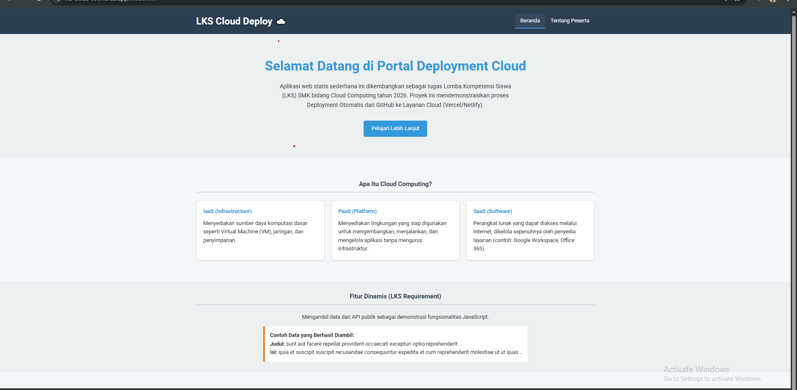
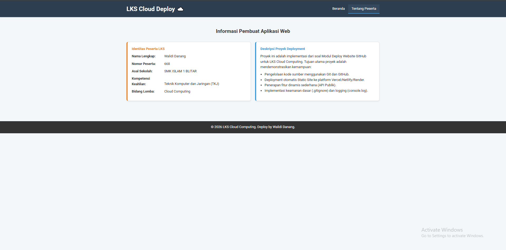

# ☁️ Proyek Deployment Web LKS Cloud Computing 2026

**Bidang Lomba:** Cloud Computing
**Peserta:** [Nama Anda]
**Nomor Peserta:** [No. Peserta LKS Anda, contoh: 007]

---

## 📝 Deskripsi Aplikasi

Aplikasi web statis ini dibuat sebagai tugas Lomba Kompetensi Siswa (LKS) SMK Tahun 2026 Bidang Cloud Computing.

**Tujuan Aplikasi:**
1.  Menyajikan informasi dasar tentang *Cloud Computing* (IaaS, PaaS, SaaS).
2.  Mendemonstrasikan proses *Continuous Deployment* (CD) dari GitHub ke layanan Cloud.
3.  Memenuhi semua kriteria teknis yang diminta (Navigasi, Keamanan, Logging).

**Struktur Proyek:**

---

## 🛠️ Langkah-Langkah Deployment ke Cloud (Vercel / Netlify)

Berikut adalah langkah-langkah yang dilakukan untuk mendeploy proyek ini secara otomatis:

1.  **Inisialisasi Git Lokal:** Direktori proyek diinisialisasi menggunakan `git init`.
2.  **Commit ke GitHub:** Seluruh file proyek (termasuk `.gitignore` dan `README.md`) di-*commit* ke repositori [Nama Repositori Anda].
3.  **Pemilihan Platform:** Platform deployment yang dipilih adalah **[Vercel/Netlify/Render]**.
4.  **Koneksi Repositori:** Akun [Vercel/Netlify] dihubungkan dengan akun GitHub.
5.  **Deployment Otomatis:** Repositori `lks-cloud-668` diimpor dan proses *Build* (*static site*) dimulai secara otomatis.
6.  **Akses:** Deployment sukses dan aplikasi dapat diakses melalui *link* di bawah.

---

## 🔗 Link & Akses

* **Link GitHub Repository:**
    (https://github.com/ptrdanang/lks-cloud-668.git)
* **Link Aplikasi Hasil Deployment:**
    (https://lks-cloud-668.vercel.app/)
---

## 🖼️ Tampilan Aplikasi (Screenshot)

**[Screenshot 1: Tampilan Halaman Beranda (index.html)]**

**[Screenshot 2: Tampilan Halaman Tentang Peserta (about.html)]**

---

## 🚧 Kendala yang Dihadapi dan Solusi

Untuk mendapatkan nilai maksimal pada kriteria Dokumentasi (3 Poin Kendala), masukkan minimal dua poin berikut:

1.  **Kendala:** Deployment awal gagal karena *path* file CSS tidak terbaca di *build environment*.
    * **Solusi:** Memperbaiki *path* di `index.html` dan `about.html` menjadi relatif (yaitu: `href="css/style.css"`).

2.  **Kendala:** Fitur API Fetching sempat gagal di browser lokal karena masalah CORS (Cross-Origin Resource Sharing).
    * **Solusi:** Karena menggunakan *API publik* (`jsonplaceholder`), masalah ini diselesaikan dengan memastikan *script* berada di bawah *tag* `<body>` dan melakukan *debugging* di *Console Log* (`console.log`), yang juga memenuhi kriteria *Logging*.